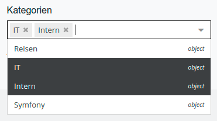

# nambu - RelationSelectFieldsBundle

### Dropdowns for relations in documents and dataobjects



#### Usage in Documents

Show a selectbox instead of the classic drag'n'drop field to configure relations inside a document. 

Relation field for one object.
```
echo $view->relation_select("my-name", [
    "objectFolder" => 33,
    "recursive" => true,
    "classes" => ["BlogCategory"],
    "types" => ["object", "asset"],
    "displayFieldName" => "Name",
]);
```

Relation field for multiple objects.
```
echo $view->relations_select("my-name", [
    "objectFolder" => 34,
    "recursive" => true,
    "classes" => ["BlogCategory"],
    "types" => ["object", "asset"],
]);
```

Base-Options for all relations.
```
types: array with allowed types of object, asset, document
```

Possible options for DataObject relations.
```
objectFolder: ID or path of a folder
classes: Filter for DataObject Types
displayFieldName: FieldName of the DataObject (e.g. Name)
recursive: Load DataObjects recursive
```

Possible options for Assets relations.
```
assetFolder: ID or path of a folder
assetTypes: Filter for types (e.g. folder, image, ...)
```

Possible options for Document relations.
```
documentFolder: ID or path of a folder
documentTypes: Filter for types (e.g. page, email, ...)
```

#### Usage in DataObjects

Choose one of the new Data-Fields in the Relations Menu and configure them.
